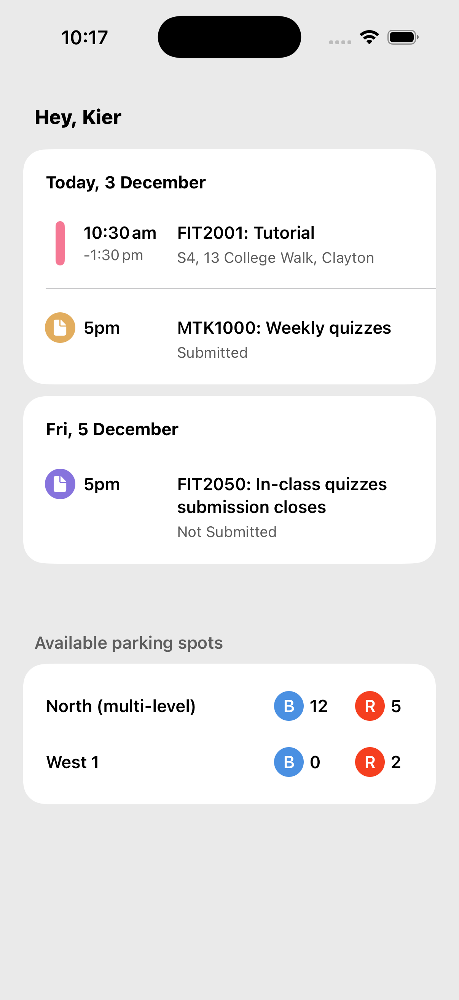

# Monash University Mobile Coding Challenge

## Xcode Project
- Xcode version used: 26.1.1
- Minimum deployment target: iOS 18
- Concurrency: Default MainActor isolation & complete concurrency checking enabled

## Architecture

- SwiftUI + MVVM (@Observable viewModel)
    - SwiftUI previews where appropriate (smaller views might preview in a pinned parent preview)
- Async/await & swift concurrency
- Dependency injection: Via the SwiftUI environment using `AppEnvironment` resolver struct.  Dependencies then passed via constructor.
- View -> ViewModel -> Repository -> Service data chain
- Swift Testing used for Unit Tests
- No external packages used for this challenge

### Project Structure
- App (App entry, DI setup)
- Core (Shared domains (models, repos, services), Extensions etc)
- Features (Feature modules (views/view models))
- Resources (assets, preview data)

## Accessibility
- Dynamic type supported
- Accessibility labels added for voice over

## Assumptions
Various assumptions have been made about the context, data structures & terminology based on the reference screenshot. 

### General
- I've assumed the Timetable & Parking summaries on the dashboard are subsets of larger feature domains elsewhere in the app.

- Data is assumed to be consumed live from an API (no local persistance accounted for, though i've commented where it could be considered). Mock services are used to mimic response from an API client calling the web.
- User is assumed signed in.  A simple mock User is  used for the dashboard greeting.

### Timetable 
- 2 types of timetable items are modelled: `Sessions` (tutorials, lectures etc) and `Tasks` (with due date).  I'm not sure of the terminology.

### Parking
- I assume the screenshot is reflecting the number of spots available for different permits (Blue and Red) in different car parks.

## AI Usage
- Xcode ChatGPT integration used for:
    - General questions about Swift/SwiftUI & some suggested code improvements
    - Generating extension methods for creating a Color from a hex string & date formatting
- Xcode inline AI tools used for:
    - Helping generate baseline documentation - which is then modified/expanded on
- External AI tools used for:
    - Generating example API json files to be used as mock data
    - Help with some SwiftUI layout suggestions/adjustments
